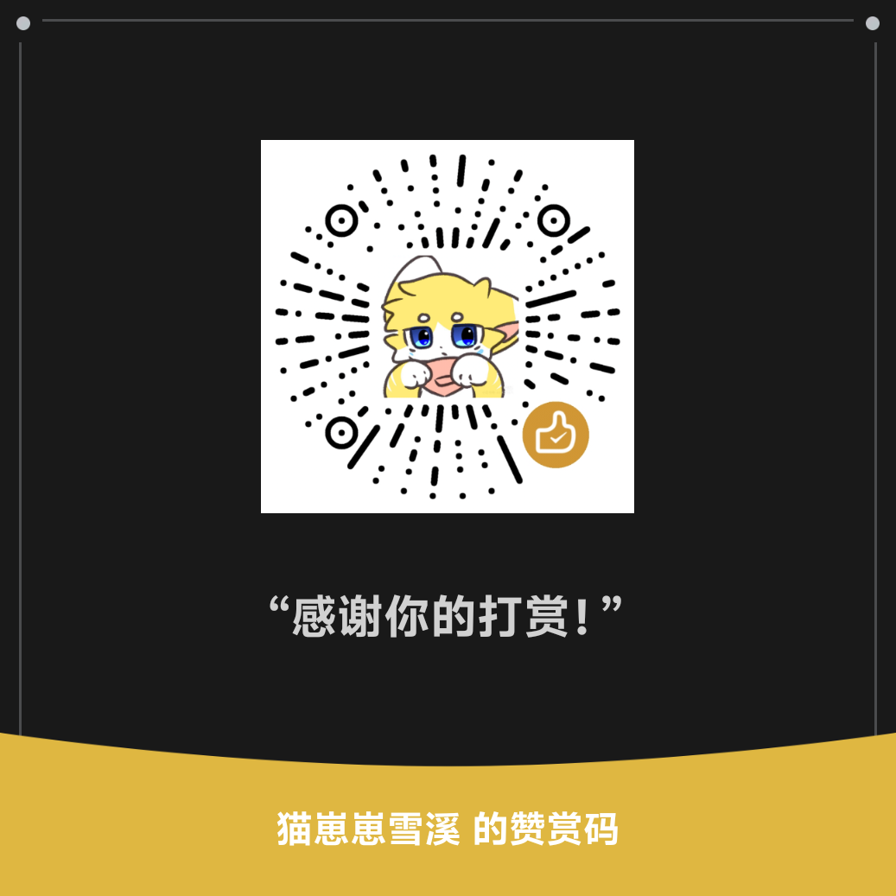

# MDW — Markdown Website Framework

A lightweight Markdown documentation site framework: renders `.md` / `.mdw` files from the `docs/` directory directly into a responsive website, with built-in navigation tree, theme customization, admin panel, and management API.

## Features

- 📝 **Markdown-like syntax** — Supports `.mdw` / `.md`, with extended custom blocks (alerts, cards, external templates)
- 📂 **Automatic routing** — Document directory hierarchy maps to URL structure, with unlimited nesting
- 🧭 **Metadata-driven navigation** — Use `title` / `nav` / `parent` / `order` / `hidden` fields to customize the sidebar
- 🎨 **Theme customization** — `static/style.css` + `static/app.js` are freely modifiable, with dark mode support
- 🔌 **Extension system** — Parser / Renderer / Middleware / custom processors
- 🔄 **Hot reload** — Save a document and the page refreshes immediately (development mode)
- ⚙️ **Admin panel** — `/admin` page to view routes and files
- 🤖 **Management API** — `/api/*` provides route list, page rendering, file upload/download, hot reload, etc. (Bearer Token authentication)

## Quick Start

```bash
pip install -r requirements.txt
python app.py
# Open http://127.0.0.1:8080
```

Create a .mdw file under docs/ and it becomes a corresponding page:

```
docs/
├── index.mdw          → /
├── about.mdw          → /about
└── guide/
    └── styles.mdw     → /guide/styles
```

## Directory Structure

```
MDW/
├── app.py              # Main entry point
├── build.py            # Nuitka packaging script
├── requirements.txt    # Dependencies
├── config/
│   └── site.yaml       # Site configuration (port / title / API Token)
├── docs/               # Documentation source (Markdown / MDW)
├── static/             # Theme assets (style.css / app.js)
├── mdw/                # Core package
└── dist/               # Build artifacts (app.exe / app.bin)
```

## Configuration

`config/site.yaml`（Auto-generated on first run）：

```yaml
host: 0.0.0.0
port: 8080
docs_dir: docs
site_title: MDW
admin_prefix: /admin
auto_reload: true
api:
  enabled: true
  token: mdw-admin        # Management API auth token, please change this
```

## Management API

| Method | Path | Description |
|GET|/api/routes|Route list|
GET /api/status Server status
GET /api/page/{path} Rendered page HTML (empty path = homepage)
GET /api/source/{path} Download raw documentation file (.md / .mdw)
POST /api/reload Trigger hot reload
POST /api/upload Upload documentation (multipart or JSON)
DELETE /api/page/{path} Delete a document (empty directories are cleaned up cascadingly)

鉴权：`Authorization: Bearer <token>` 或 `?token=<token>`。

完整参考见 `docs/api/reference.mdw`（含 curl / Python 通用示例）。

## 编译可执行文件

依赖：Nuitka + 对应平台编译器（Windows: MSVC / Linux: gcc+patchelf）。

编译前会自动把 `docs/`（教程）、`static/`（主题）、默认 `config/` 打包进二进制
（`python build.py --bundle` 或编译时自动执行），生成 `mdw/_bundle_assets.py`。

```bash
# Windows（产出 dist/app.exe，单文件，zstd 压缩）
python -m nuitka --standalone --onefile --windows-console-mode=force \
  --output-dir=dist \
  --include-data-dir=mdw/templates=mdw/templates \
  --include-package=pygments --include-package=pygments.lexers \
  --include-package=pygments.formatters --include-package=pygments.styles \
  --include-package=yaml --assume-yes-for-downloads app.py

# Linux（产出 dist/app.bin；在 Linux 环境/容器中执行）
python -m nuitka --standalone --onefile --output-dir=dist \
  --include-data-dir=mdw/templates=mdw/templates \
  --include-package=pygments --include-package=pygments.lexers \
  --include-package=pygments.formatters --include-package=pygments.styles \
  --include-package=yaml --assume-yes-for-downloads app.py
```

运行编译产物：直接执行 `app` / `app.exe` 即可。**无需手动准备任何文件**——
首次运行会自动把内置的 `docs/`（教程文档）、`static/`（主题样式）和默认
`config/site.yaml` 解压到程序同目录；用户已有内容不会被覆盖。

## 文档

站点内置完整教程（`docs/`）：

- `docs/guide/` — 📖 编写指南：快速开始、语法基础、元数据、样式、模板、扩展、部署
- `docs/examples/` — 🧪 示例集：各功能开箱即用的完整示例
- `docs/api/` — 🤖 管理 API：接口参考与通用客户端示例

启动后访问站点即在线阅读，侧边栏自动生成导航树。

## 相关项目

- 📱 **[MDW-Manager](https://github.com/xuexi-meow/MDW-Manager)** — 多平台 MDW 管理器（Android / 桌面端），可视化管理文档、上传下载、远程控制

## 支持

如果 MDW 对你有帮助，欢迎打赏支持：



*ps:本项目由deepseek-v4辅助完成*

## 许可

MIT
